<div align="center">
<div align="center">
   <h1><b><i>Rapid ⚡︎ LaTeX OCR</i></b></h1>
</div>
<div>&nbsp;</div>

<a href="https://swhl-rapidlatexocrdemo.hf.space" target="_blank"></a>
<a href="https://www.modelscope.cn/studios/liekkas/RapidLatexOCRDemo/summary" target="_blank"></a>
<a href="">=3.6,<3.12-aff.svg"></a>
<a href=""></a>
<a href="https://pepy.tech/project/rapid_latex_ocr"></a>
<a href="https://pypi.org/project/rapid_latex_ocr/"></a>
<a href="https://semver.org/"></a>
<a href="https://github.com/psf/black"></a>

</div>

### Introduction
`rapid_latex_ocr` is a tool to convert formula images to latex format.

**The reasoning code in the repo is modified from [LaTeX-OCR](https://github.com/lukas-blecher/LaTeX-OCR), the model has all been converted to ONNX format, and the reasoning code has been simplified, Inference is faster and easier to deploy.**

The repo only has codes based on `ONNXRuntime` or `OpenVINO` inference in onnx format, and does not contain training model codes. If you want to train your own model, please move to [LaTeX-OCR](https://github.com/lukas-blecher/LaTeX-OCR).

If it helps you, please give a little star ⭐ or sponsor a cup of coffee (click the link in Sponsor at the top of the page)

🔥🔥🔥 Model Conversion Notes 👉 [ConvertLaTeXOCRToONNX](https://github.com/SWHL/ConvertLaTeXOCRToONNX)

### [Demo](https://swhl-rapidlatexocrdemo.hf.space)

<div align="center">
    
</div>

### Framework

```mermaid
flowchart LR

A([Train\n LaTeX-OCR]) --> B([Convert \n ConvertLaTeXOCRToONNX]) --> C([🎨 Deploy\n RapidLaTeXOCR])

click A "https://github.com/lukas-blecher/LaTeX-OCR" _blank
click B "https://github.com/SWHL/ConvertLaTeXOCRToONNX" _blank
click C "https://github.com/RapidAI/RapidLaTeXOCR" _blank
```


### TODO
- [ ] Rewrite LaTeX-OCR GUI version based on `rapid_latex_ocr`
- [x] Add demo in the hugging face
- [ ] Integrate other better models
- [ ] Add support for OpenVINO

### Installation
> NOTE: When installing the package through pip, the model file will be automatically downloaded and placed under models in the installation directory.
>
> If the Internet speed is slow, you can download it separately through [Google Drive](https://drive.google.com/drive/folders/1e8BgLk1cPQDSZjgoLgloFYMAQWLTaroQ?usp=sharing) | [Baidu NetDisk](https://pan.baidu.com/s/1rnYmmKp2HhOkYVFehUiMNg?pwd=dh72).

```bash
pip install rapid_latex_ocr
```

### Usage
#### Used by python script:
```python
from rapid_latex_ocr import LatexOCR

model = LatexOCR()

img_path = "tests/test_files/6.png"
with open(img_path, "rb") as f:
    data = f.read()

res, elapse = model(data)

print(res)
print(elapse)
```
#### Used by command line.
```bash
$ rapid_latex_ocr tests/test_files/6.png

# {\\frac{x^{2}}{a^{2}}}-{\\frac{y^{2}}{b^{2}}}=1
# 0.47902780000000034
```

### Changlog
2023-12-07 v0.0.5 update:
- Add the relevant code to automatically download the model when installing the package

2023-09-13 v0.0.4 update:
- Merge [pr #5](https://github.com/RapidAI/RapidLatexOCR/pull/5)
- Optim code

2023-07-15 v0.0.1 update:
- First release

### Code Contributors
<p align="left">
  <a href="https://github.com/RapidAI/RapidLatexOCR/graphs/contributors">
    
  </a>
</p>

### Contributing
Pull requests are welcome. For major changes, please open an issue first to discuss what you would like to change.

Please make sure to update tests as appropriate.

### [Sponsor](https://swhl.github.io/RapidVideOCR/docs/sponsor/)

If you want to sponsor the project, you can directly click the **Buy me a coffee** image, please write a note (e.g. your github account name) to facilitate adding to the sponsorship list below.

<div align="left">
  <a href="https://www.buymeacoffee.com/SWHL"></a>
</div>

### License
This project is released under the [MIT license](./LICENSE).
